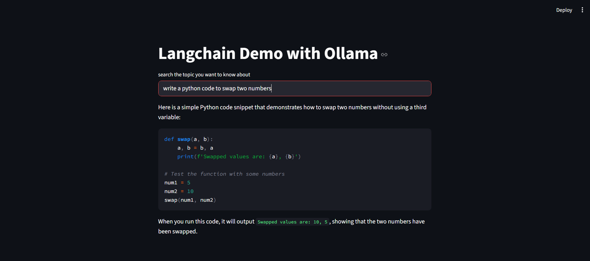
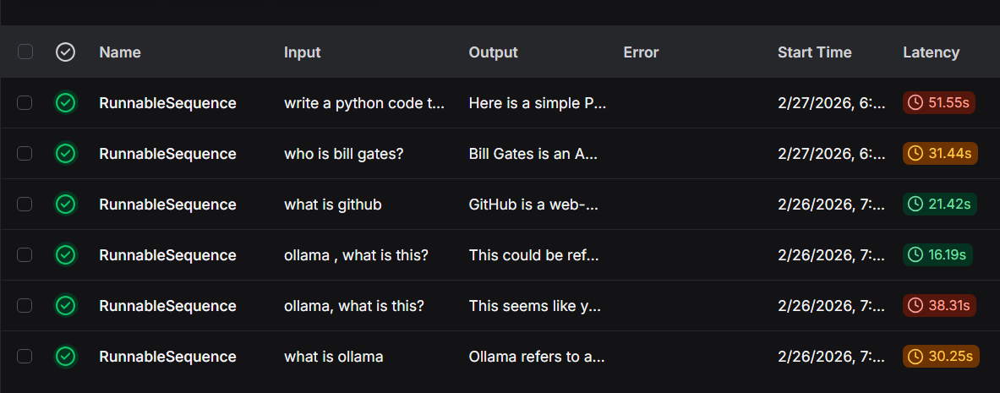

# Generative-AI-with-LangChain
An end-to-end Generative AI chatbot built using LangChain with support of open-source LLMs (Ollama).

#Sample Conversation


#LangSmith Dashboard with tracing and evaluation of the conversation


# Getting Started   
1. Clone the repository
```bash
git clone https://github.com/anshul-singh1/Generative-AI-with-LangChain.git
cd Generative-AI-with-LangChain
```
2. Install the dependencies
```bashpip install -r requirements.txt
```
3. Run the application
```bashpython app.py
```
4. Open your browser and navigate to `http://localhost:5000` to interact with the chatbot.  